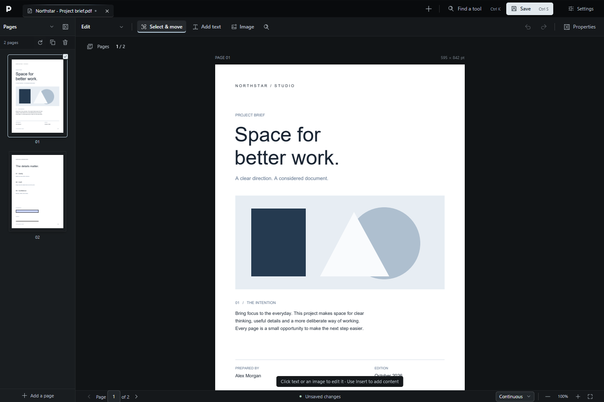
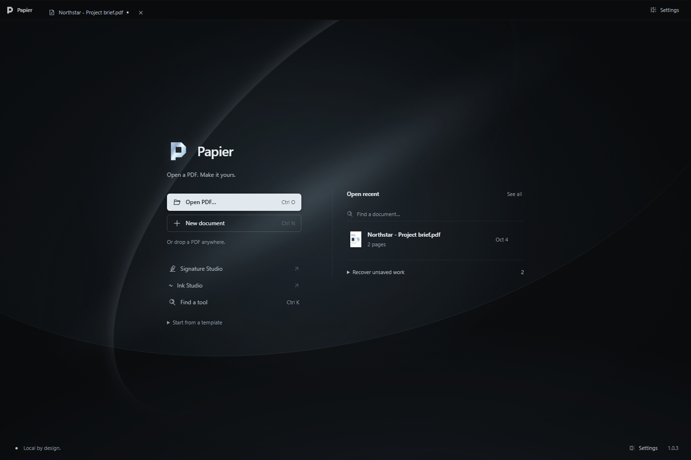
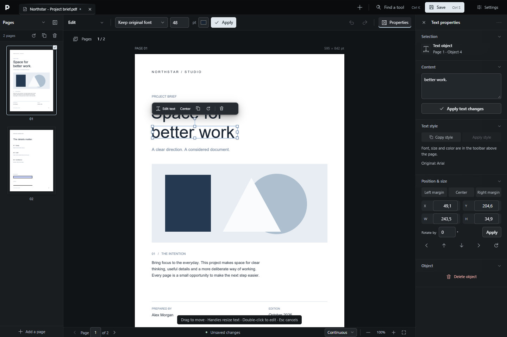
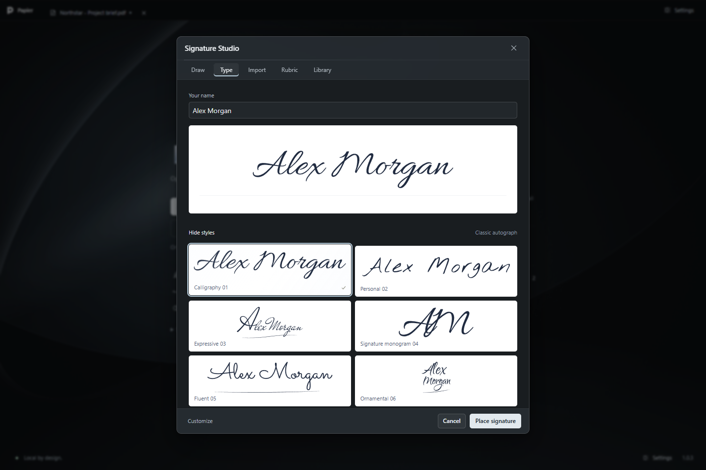
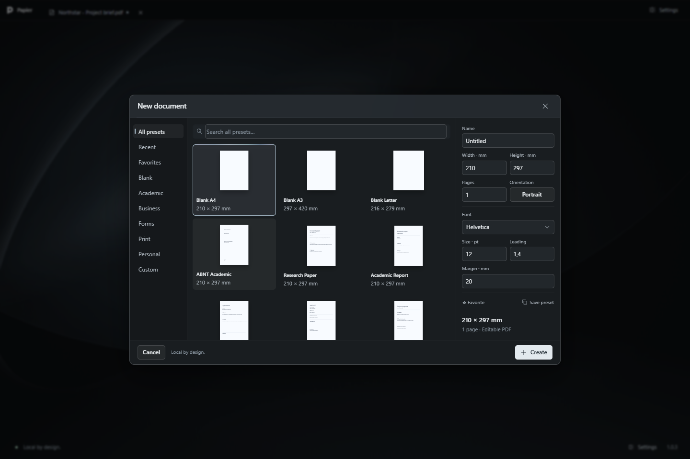

  
  <h1>Papier</h1>
  
<strong>Paperwork, reworked.</strong>

  
Edit, organize and sign PDFs without sending them anywhere.

  
<a href="https://github.com/LASTKING12093/papier/releases/latest"><strong>Download for Windows</strong></a> · <a href="#inside-papier">Explore Papier</a> · <a href="CONTRIBUTING.md">Build from source</a>

Papier is a local-first desktop PDF editor for Windows. Work directly on the page, keep the controls close to the task, and move from editing to review without leaving your document.

## Inside Papier

- **Edit the page.** Select, move and resize text and images. Change text, fonts, size and color with contextual controls. Add wrapped paragraphs, images and vector marks.
- **Organize documents.** Reorder, rotate, crop, insert, extract and merge pages. Inspect document properties, bookmarks and attachments.
- **Review clearly.** Highlight, comment, draw, compare documents and redact sensitive content. Run OCR locally with English, Portuguese and Spanish language packs.
- **Make your mark.** Create signatures and rubrics, refine hand-drawn strokes, and place reusable marks. Certificate signing uses Windows certificate providers when configured.
- **Work with less friction.** Templates, a searchable command palette, keyboard shortcuts, undo/redo and local recovery keep common tasks close.

<table>
  <tr><td></td><td></td></tr>
  <tr><td></td><td></td></tr>
</table>

A desktop document workspace: a dominant canvas, contextual tools, compact controls and purposeful motion. These previews use fictional documents created for this project.

## Install

1. [Download the latest Windows x64 installer](https://github.com/LASTKING12093/papier/releases/latest).
2. Run `Papier-1.0.3-Setup-x64.exe`.
3. Open Papier and choose a PDF.

Windows 10/11 x64 with WebView2 is required. The installer checks for the runtime. You do **not** need Node.js, Rust, Python or Git to use Papier.

The installer is unsigned. Windows may display an unknown-publisher or SmartScreen warning; Papier does not bypass Windows security. Release assets include SHA-256 checksums so you can verify the downloaded file.

## Your documents stay yours

PDF editing, rendering and OCR run on your computer. Papier does not include document uploads, analytics or a crash-upload service. Recent documents, recovery copies, preferences and saved signatures remain local; local storage is not encrypted by Papier.

Runtime installation and Windows certificate services may involve network activity. Read the [privacy details](docs/PRIVACY.md) and [security policy](SECURITY.md) for the precise boundaries.

## Know the limits

PDF is a fixed-layout format. Complex embedded fonts, scanned pages and flattened artwork may need substitution or OCR; editing is not equivalent to reflowing a word-processing document. A drawn signature is a visual mark, not a cryptographic certificate signature. Always review the saved result before sharing an important document.

## Open source

Papier's original code is [MIT licensed](LICENSE). Fonts, native libraries and other dependencies retain their own licenses; see [third-party notices](THIRD_PARTY_NOTICES.md). Microsoft runtime components in the Windows distribution are not covered by the MIT license.

For development, tests and packaging, read [CONTRIBUTING.md](CONTRIBUTING.md). The [architecture overview](docs/ARCHITECTURE.md) explains the frontend, native worker and document safety model.

Found a bug? [Open an issue](https://github.com/LASTKING12093/papier/issues/new/choose) with a minimal fictional example. Report security vulnerabilities [privately](SECURITY.md), and never attach a confidential PDF.
